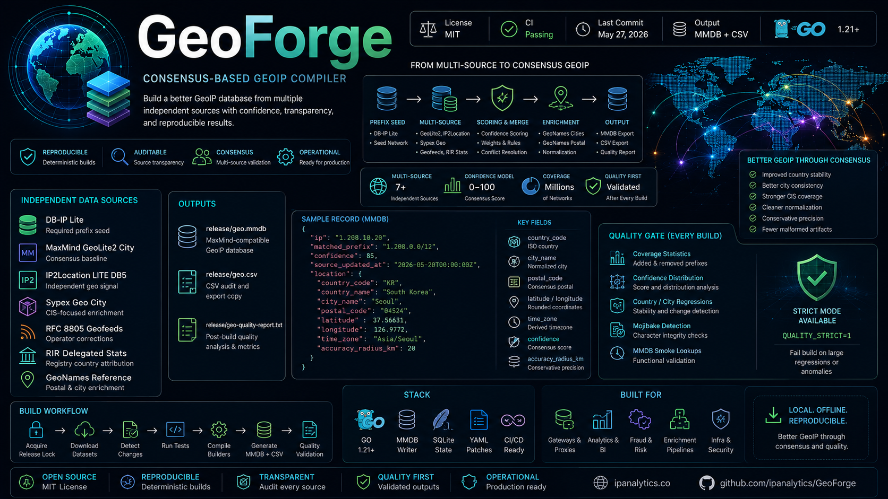

# GeoForge

<p align="center">
  
</p>

<p align="center">
  <a href="LICENSE">
    
  </a>
  <a href="https://github.com/ipanalytics/GeoForge/actions">
    
  </a>
  <a href="https://github.com/ipanalytics/GeoForge">
    
  </a>
  <a href="https://github.com/ipanalytics/GeoForge">
    
  </a>
  <a href="https://github.com/ipanalytics/GeoForge">
    
  </a>
  <a href="https://github.com/ipanalytics/GeoForge">
    
  </a>
</p>

---

GeoForge is a reproducible GeoIP database compiler that builds a local MaxMind-compatible MMDB from multiple independent geolocation sources.

The pipeline combines DB-IP Lite, MaxMind GeoLite2, IP2Location LITE, Sypex Geo, operator geofeeds, RIR delegated statistics, and GeoNames reference datasets into a normalized consensus-based geolocation layer.

Primary outputs:

* `release/geo.mmdb`
* `release/geo.csv`
* `release/geo-quality-report.txt`

---

## Overview

Free GeoIP datasets typically optimize for broad coverage, not cross-source validation.

GeoForge approaches geolocation as a consensus problem:

```text id="v6v3l1"
prefix seed
    -> multi-source candidate collection
    -> confidence scoring
    -> normalization
    -> conflict resolution
    -> reproducible MMDB output
```

The builder merges independent signals, downranks inconsistent records, applies conservative normalization rules, and produces an auditable local database suitable for gateways, analytics, enrichment services, fraud systems, and infrastructure tooling.

The project is designed for:

* offline local lookups
* deterministic rebuilds
* source transparency
* quality regression tracking
* operational GeoIP enrichment

---

## Architecture

```text id="w6u0a6"
                 Source Databases
                         │
      ┌──────────────────┼──────────────────┐
      │                  │                  │
      ▼                  ▼                  ▼
   GeoLite2         IP2Location        Sypex Geo
      │                  │                  │
      └──────────────┬───┴──────────────────┘
                     ▼
              Consensus Engine
         scoring / merge / weighting
                     ▼
             GeoNames Enrichment
          postal / city normalization
                     ▼
               Output Cleanup
         timezone / precision / QA
                     ▼
                 MMDB Export
```

---

## Repository Layout

```text id="qzjlwm"
cmd/
├── builder/         Main database compiler
└── qualitycheck/    Post-build validation

internal/
├── consensus/       Merge and scoring logic
├── geofeed/         RFC 8805 parser/index
├── geozip/          GeoNames enrichment
├── output/          Final normalization
├── refdata/         Country/currency metadata
├── rirstats/        RIR delegated statistics
└── strnorm/         String normalization

data/
release/
scripts/
```

Downloaded source datasets and generated outputs are intentionally gitignored.

---

## Data Sources

| Source                | Role                           |
| --------------------- | ------------------------------ |
| DB-IP Lite            | Required prefix seed           |
| MaxMind GeoLite2 City | Consensus baseline             |
| IP2Location LITE DB5  | Independent geo signal         |
| Sypex Geo City        | CIS-focused enrichment         |
| RFC 8805 geofeeds     | Operator-published corrections |
| RIR delegated stats   | Registry country attribution   |
| GeoNames postal dump  | Postal enrichment              |
| GeoNames cities1000   | City geoname resolution        |

GeoForge separates source collection from output generation, allowing partial builds when some datasets are unavailable.

---

## Build

Create a local environment file:

```bash id="98c9ga"
cp admin.env.example admin.env
```

Run the pipeline:

```bash id="91ol1k"
./geo.sh
```

The build workflow:

1. Acquires a release lock
2. Downloads updated datasets
3. Detects source changes
4. Runs Go tests
5. Compiles builders
6. Generates MMDB + CSV outputs
7. Runs quality validation

Force rebuild:

```bash id="kt8o26"
FORCE_BUILD=1 ./geo.sh
```

Disable downloads:

```bash id="dffxx7"
AUTO_DOWNLOAD=0 ./geo.sh
```

---

## Outputs

| File                             | Description                       |
| -------------------------------- | --------------------------------- |
| `release/geo.mmdb`               | MaxMind-compatible GeoIP database |
| `release/geo.csv`                | CSV audit/export copy             |
| `release/geo-quality-report.txt` | Post-build quality analysis       |
| `release/geo.previous.csv`       | Previous snapshot for diffing     |

---

## Record Schema

Each MMDB entry contains top-level metadata plus a nested `location` object.

### Top-Level Fields

| Field               | Description                       |
| ------------------- | --------------------------------- |
| `matched_prefix`    | CIDR written into MMDB            |
| `confidence`        | Consensus confidence score        |
| `source_updated_at` | UTC build timestamp               |
| `country_metadata`  | Country/currency/calling metadata |
| `location`          | Final geolocation object          |

### Location Fields

| Field                   | Description                    |
| ----------------------- | ------------------------------ |
| `continent_code`        | Continent code                 |
| `country_code`          | ISO country                    |
| `registry_country_code` | RIR-derived registry country   |
| `subdivision_name`      | Normalized admin region        |
| `city_geoname_id`       | GeoNames city identifier       |
| `city_name`             | Normalized city                |
| `postal_code`           | Consensus postal code          |
| `latitude`              | Rounded latitude               |
| `longitude`             | Rounded longitude              |
| `time_zone`             | Derived timezone               |
| `accuracy_radius_km`    | Conservative accuracy estimate |

---

## Example Record

```json id="k7v7uy"
{
  "ip": "1.208.10.20",
  "matched_prefix": "1.208.0.0/12",
  "confidence": 85,
  "source_updated_at": "2026-05-20T00:00:00Z",
  "location": {
    "country_code": "KR",
    "country_name": "South Korea",
    "city_name": "Seoul",
    "postal_code": "04524",
    "latitude": 37.56631,
    "longitude": 126.9772,
    "time_zone": "Asia/Seoul",
    "accuracy_radius_km": 20
  }
}
```

---

## Quality Model

GeoForge is designed to improve operational quality through source consensus rather than raw source replacement.

Expected improvements over single-source lite datasets:

* better country stability
* improved city consistency
* stronger CIS coverage
* cleaner normalization
* more conservative precision signaling
* reduced malformed text artifacts

The builder intentionally favors stable consensus over aggressive precision claims.

---

## Quality Gate

After each build, the pipeline runs a post-build validation stage and generates:

```text id="2ifjlwm"
release/geo-quality-report.txt
```

Validation includes:

* coverage statistics
* confidence distribution
* added/removed prefixes
* country/city regressions
* mojibake detection
* MMDB smoke lookups

Enable strict mode:

```bash id="0xx2kq"
QUALITY_STRICT=1 ./geo.sh
```

Strict mode fails the build on large regressions or suspicious output anomalies.

---

## Normalization

Final records are normalized immediately before export.

Normalization includes:

* coordinate rounding
* mojibake repair
* subdivision cleanup
* duplicate collapse
* timezone derivation
* conservative multilingual cleanup

Normalization intentionally avoids broad transliteration or aggressive geopolitical rewriting.

---

## Geofeeds

Allowlisted RFC 8805 feeds are configured in:

```text id="u6u1kq"
data/geofeeds/allowlist.tsv
```

Supported formats:

```text id="s5kzzf"
prefix,country,region,city
prefix,country,region,city,postal
```

Default IPv4 floor:

```text id="zy7t6x"
GEOFEED_MAX_IPV4_BITS=24
```

This prevents excessive host-level fragmentation from narrow geofeed entries.

---

## Update Semantics

The downloader uses content hashing and atomic replacement semantics.

Tracked state files:

```text id="dcbx3n"
data/download-state.tsv
data/download-changed.txt
```

If no source changed, the builder preserves the existing MMDB unless forced.

---

## Use Cases

| Domain          | Example                  |
| --------------- | ------------------------ |
| Fraud Detection | Geo consistency checks   |
| SIEM Enrichment | Country/city attribution |
| Analytics       | Geographic aggregation   |
| Gateways        | Local GeoIP lookups      |
| Data Pipelines  | IP enrichment            |
| Infrastructure  | Region-aware routing     |

---

## Operational Notes

* City-level geolocation remains probabilistic
* Mobile and VPN accuracy may vary substantially
* Prefix coverage depends on DB-IP Lite seed availability
* Postal enrichment should be treated as opportunistic
* Geofeeds improve operator-owned allocations but are uneven globally

---

## Publication

The repository is designed so code can be published independently from downloaded datasets.

Do not commit:

* `admin.env`
* downloaded provider databases
* generated release artifacts
* API credentials or license tokens

Review `THIRD_PARTY_DATA.md` before redistributing derived outputs.

---

## Roadmap

Planned additions:

* ASN-aware geo heuristics
* confidence-weighted source tuning
* regional regression dashboards
* IPv6 quality scoring
* compressed bulk exports
* build reproducibility attestations

---

## License

See [`LICENSE`](./LICENSE).

Additional redistribution guidance:

```text id="4ft7ps"
THIRD_PARTY_DATA.md
```

---

## Disclaimer

GeoForge aggregates third-party geolocation datasets into derived operational outputs. IP geolocation should be treated as probabilistic infrastructure metadata, not physical-user attribution.
