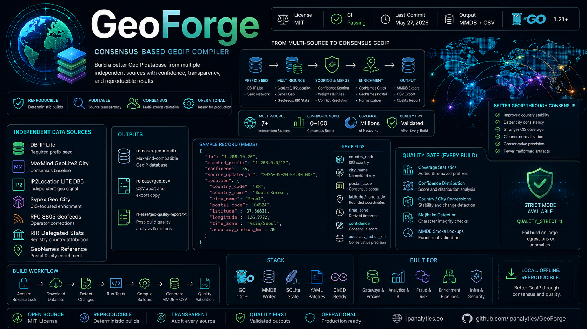

_English version: [README.md](README.md)_

# GeoForge

<p align="center">
  
</p>

<p align="center">
  <a href="LICENSE">
    
  </a>
  <a href="https://github.com/ipanalytics/GeoForge/actions">
    
  </a>
  <a href="https://github.com/ipanalytics/GeoForge">
    
  </a>
  <a href="https://github.com/ipanalytics/GeoForge">
    
  </a>
  <a href="https://github.com/ipanalytics/GeoForge">
    
  </a>
  <a href="https://github.com/ipanalytics/GeoForge">
    
  </a>
</p>

---

GeoForge — воспроизводимый компилятор GeoIP-баз данных, который собирает локальную MMDB, совместимую с MaxMind, из нескольких независимых источников геолокации.

Конвейер объединяет DB-IP Lite, MaxMind GeoLite2, IP2Location LITE, Sypex Geo, geofeed операторов, делегированную статистику RIR и справочные наборы данных GeoNames в нормализованный слой геолокации на основе консенсуса.

Основные выходные файлы:

* `release/geo.mmdb`
* `release/geo.csv`
* `release/geo-quality-report.txt`

---

## Обзор

Бесплатные GeoIP-наборы данных обычно оптимизированы под широкое покрытие, а не под кросс-проверку между источниками.

GeoForge рассматривает геолокацию как задачу консенсуса:

```text id="v6v3l1"
prefix seed
    -> multi-source candidate collection
    -> confidence scoring
    -> normalization
    -> conflict resolution
    -> reproducible MMDB output
```

Сборщик объединяет независимые сигналы, понижает рейтинг несогласованных записей, применяет консервативные правила нормализации и создаёт поддающуюся аудиту локальную базу данных, пригодную для шлюзов, аналитики, сервисов обогащения, систем антифрода и инфраструктурных инструментов.

Проект рассчитан на:

* автономные локальные запросы
* детерминированные пересборки
* прозрачность источников
* отслеживание регрессий качества
* эксплуатационное GeoIP-обогащение

---

## Архитектура

```text id="w6u0a6"
                 Source Databases
                         │
      ┌──────────────────┼──────────────────┐
      │                  │                  │
      ▼                  ▼                  ▼
   GeoLite2         IP2Location        Sypex Geo
      │                  │                  │
      └──────────────┬───┴──────────────────┘
                     ▼
              Consensus Engine
         scoring / merge / weighting
                     ▼
             GeoNames Enrichment
          postal / city normalization
                     ▼
               Output Cleanup
         timezone / precision / QA
                     ▼
                 MMDB Export
```

---

## Структура репозитория

```text id="qzjlwm"
cmd/
├── builder/         Main database compiler
└── qualitycheck/    Post-build validation

internal/
├── consensus/       Merge and scoring logic
├── geofeed/         RFC 8805 parser/index
├── geozip/          GeoNames enrichment
├── output/          Final normalization
├── refdata/         Country/currency metadata
├── rirstats/        RIR delegated statistics
└── strnorm/         String normalization

data/
release/
scripts/
```

Загруженные исходные наборы данных и сгенерированные выходные файлы намеренно исключены из репозитория (gitignore).

---

## Источники данных

| Source                | Role                           |
| --------------------- | ------------------------------ |
| DB-IP Lite            | Обязательный затравочный набор префиксов |
| MaxMind GeoLite2 City | Базовая линия консенсуса       |
| IP2Location LITE DB5  | Независимый геолокационный сигнал |
| Sypex Geo City        | Обогащение с фокусом на СНГ    |
| RFC 8805 geofeeds     | Коррекции, публикуемые операторами |
| RIR delegated stats   | Страновая атрибуция по данным реестров |
| GeoNames postal dump  | Обогащение почтовыми индексами |
| GeoNames cities1000   | Сопоставление городов с geoname |

GeoForge разделяет сбор источников и генерацию выходных данных, что позволяет выполнять частичные сборки, когда некоторые наборы данных недоступны.

---

## Сборка

Создайте локальный файл окружения:

```bash id="98c9ga"
cp admin.env.example admin.env
```

Запустите конвейер:

```bash id="91ol1k"
./geo.sh
```

Процесс сборки:

1. Захватывает блокировку релиза
2. Загружает обновлённые наборы данных
3. Определяет изменения в источниках
4. Запускает тесты Go
5. Компилирует сборщики
6. Генерирует выходные файлы MMDB + CSV
7. Запускает проверку качества

Принудительная пересборка:

```bash id="kt8o26"
FORCE_BUILD=1 ./geo.sh
```

Отключение загрузок:

```bash id="dffxx7"
AUTO_DOWNLOAD=0 ./geo.sh
```

---

## Выходные данные

| Файл                             | Описание                            |
| -------------------------------- | ----------------------------------- |
| `release/geo.mmdb`               | MaxMind-совместимая база данных GeoIP |
| `release/geo.csv`                | Копия CSV для аудита/экспорта       |
| `release/geo-quality-report.txt` | Анализ качества после сборки        |
| `release/geo.previous.csv`       | Предыдущий снимок для сравнения     |

---

## Схема записи

Каждая запись MMDB содержит метаданные верхнего уровня плюс вложенный объект `location`.

### Поля верхнего уровня

| Поле                | Описание                              |
| ------------------- | ------------------------------------- |
| `matched_prefix`    | CIDR, записываемый в MMDB             |
| `confidence`        | Оценка уверенности на основе консенсуса |
| `source_updated_at` | Метка времени сборки в UTC            |
| `country_metadata`  | Метаданные страны/валюты/телефонного кода |
| `location`          | Итоговый объект геолокации            |

### Поля location

| Поле                    | Описание                              |
| ----------------------- | ------------------------------------- |
| `continent_code`        | Код континента                        |
| `country_code`          | Страна по ISO                         |
| `registry_country_code` | Страна реестра, определённая по RIR   |
| `subdivision_name`      | Нормализованный административный регион |
| `city_geoname_id`       | Идентификатор города GeoNames         |
| `city_name`             | Нормализованный город                 |
| `postal_code`           | Консенсусный почтовый индекс          |
| `latitude`              | Округлённая широта                    |
| `longitude`             | Округлённая долгота                   |
| `time_zone`             | Вычисленный часовой пояс              |
| `accuracy_radius_km`    | Консервативная оценка точности        |

---

## Пример записи

```json id="k7v7uy"
{
  "ip": "1.208.10.20",
  "matched_prefix": "1.208.0.0/12",
  "confidence": 85,
  "source_updated_at": "2026-05-20T00:00:00Z",
  "location": {
    "country_code": "KR",
    "country_name": "South Korea",
    "city_name": "Seoul",
    "postal_code": "04524",
    "latitude": 37.56631,
    "longitude": 126.9772,
    "time_zone": "Asia/Seoul",
    "accuracy_radius_km": 20
  }
}
```

---

## Модель качества

GeoForge разработан для повышения эксплуатационного качества за счёт консенсуса источников, а не простой замены исходных данных.

Ожидаемые улучшения по сравнению с одноисточниковыми lite-наборами данных:

* более стабильное определение страны
* улучшенная согласованность городов
* более широкое покрытие СНГ
* более чистая нормализация
* более консервативная сигнализация точности
* меньше артефактов искажённого текста

Сборщик намеренно отдаёт предпочтение стабильному консенсусу, а не агрессивным заявлениям о точности.

---

## Контроль качества (Quality Gate)

После каждой сборки конвейер запускает этап пост-сборочной валидации и генерирует:

```text id="2ifjlwm"
release/geo-quality-report.txt
```

Валидация включает:

* статистику покрытия
* распределение уверенности
* добавленные/удалённые префиксы
* регрессии по стране/городу
* обнаружение искажений кодировки (mojibake)
* контрольные smoke-запросы к MMDB

Включение строгого режима:

```bash id="0xx2kq"
QUALITY_STRICT=1 ./geo.sh
```

В строгом режиме сборка завершается ошибкой при значительных регрессиях или подозрительных аномалиях в выводе.

---

## Нормализация

Итоговые записи нормализуются непосредственно перед экспортом.

Нормализация включает:

* округление координат
* исправление искажений кодировки (mojibake)
* очистку административных регионов
* схлопывание дубликатов
* вычисление часового пояса
* консервативную многоязычную очистку

Нормализация намеренно избегает широкой транслитерации и агрессивного геополитического переписывания.

---

## Geofeeds

Разрешённые (allowlist) фиды RFC 8805 настраиваются в:

```text id="u6u1kq"
data/geofeeds/allowlist.tsv
```

Поддерживаемые форматы:

```text id="s5kzzf"
prefix,country,region,city
prefix,country,region,city,postal
```

Ограничение по умолчанию для IPv4:

```text id="zy7t6x"
GEOFEED_MAX_IPV4_BITS=24
```

Это предотвращает чрезмерную фрагментацию на уровне отдельных хостов из-за узких записей geofeed.

---

## Семантика обновления

Загрузчик использует хеширование содержимого и семантику атомарной замены.

Отслеживаемые файлы состояния:

```text id="dcbx3n"
data/download-state.tsv
data/download-changed.txt
```

Если ни один источник не изменился, сборщик сохраняет существующую MMDB, если не указано принудительное обновление.

---

## Сценарии использования

| Область                        | Пример                            |
| ------------------------------ | --------------------------------- |
| Обнаружение мошенничества      | Проверки географической согласованности |
| Обогащение SIEM                | Атрибуция по стране/городу        |
| Аналитика                      | Географическая агрегация          |
| Шлюзы                          | Локальные запросы GeoIP           |
| Конвейеры данных               | Обогащение по IP                  |
| Инфраструктура                 | Маршрутизация с учётом региона    |

---

## Эксплуатационные примечания

* Геолокация на уровне городов остаётся вероятностной
* Точность для мобильных сетей и VPN может существенно варьироваться
* Покрытие префиксами зависит от доступности seed-данных DB-IP Lite
* Обогащение почтовыми индексами следует рассматривать как негарантированное (opportunistic)
* Geofeeds улучшают данные по выделениям операторов, но распределены по миру неравномерно

---

## Публикация

Репозиторий устроен так, чтобы код можно было публиковать независимо от загруженных наборов данных.

Не включайте в коммиты:

* `admin.env`
* загруженные базы данных провайдеров
* сгенерированные артефакты релиза
* учётные данные API или лицензионные токены

Перед распространением производных выходных данных ознакомьтесь с `THIRD_PARTY_DATA.md`.

---

## Дорожная карта

Планируемые дополнения:

* геоэвристики с учётом ASN
* настройка источников с весами достоверности
* дашборды региональной регрессии
* оценка качества IPv6
* сжатые массовые экспорты
* аттестации воспроизводимости сборки

---

## Лицензия

См. [`LICENSE`](./LICENSE).

Дополнительные рекомендации по распространению:

```text id="4ft7ps"
THIRD_PARTY_DATA.md
```

---

## Отказ от ответственности

GeoForge агрегирует сторонние наборы геолокационных данных в производные эксплуатационные выходные данные. Геолокацию IP следует рассматривать как вероятностные метаданные об инфраструктуре, а не как атрибуцию физического пользователя.
